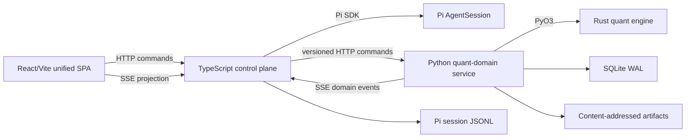

# Architecture

## Runtime shape

## Capability authority

| Capability | Authority |
|---|---|
| LLM turn, branch, compaction, steer/follow-up | Pi through the TypeScript adapter |
| Active sessions, workbench binding, live routing | TypeScript control plane |
| Project, task, context, inbox/outbox, revision, variant, run metadata | Python domain service |
| Formal backtest calculations | Rust/PyO3 quant engine |
| Relationship and lineage truth | Research Project Graph in the domain service |
| Visual projection and interaction | One React/Vite SPA |
| Raw conversation tree | Pi JSONL |
| Large immutable output | Content-addressed artifact store |

## Process rules

- No iframe, microfrontend, duplicated SPA, Redis, gRPC, or second message bus in the POC.
- No always-on supervisor LLM.
- No second workflow executor inside the infinite canvas.
- Active live routing is in-process. Durable coordination is persisted through the Python service.
- Large payloads cross process boundaries by artifact reference.

## Recovery

After restart, the control plane reconstructs active state from Pi JSONL, the durable session catalog, inbox/outbox, task/job state, and the event ledger. In-memory handles are never treated as durable proof.
